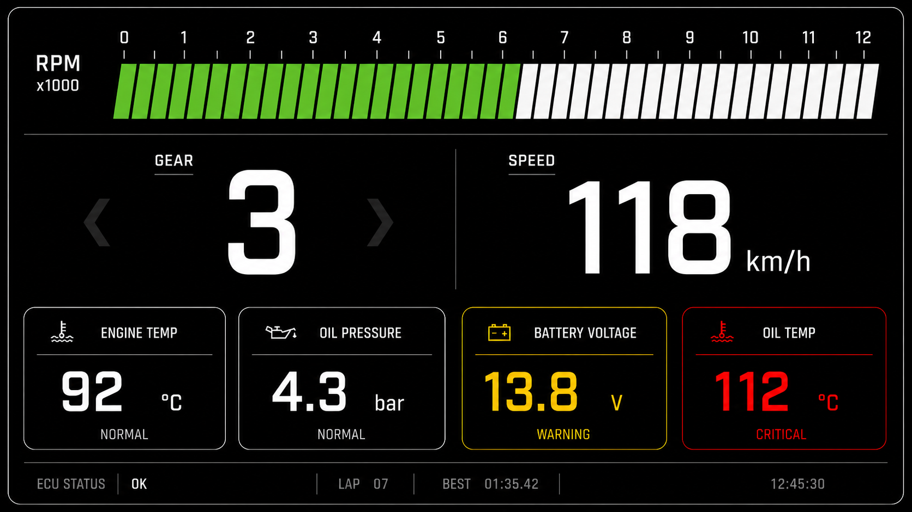

# Formula Student Vehicle Dashboard 🏎️

A real-time dashboard interface developed for the DU Racing Team's Formula Student / FSAE vehicle.

The dashboard is designed to run on a Raspberry Pi 5 and visualize critical vehicle data such as RPM, speed, gear, and sensor information.

## 🖥️ Dashboard Preview

## Features

- Real-time RPM visualization
- Speed and gear display
- Critical sensor data monitoring
- Mock data support for development and testing
- Architecture prepared for CAN Bus and ECU integration

## Tech Stack

- React
- JavaScript
- Vite
- Node.js
- WebSocket
- Python
- Raspberry Pi 5
- CAN Bus / ECU integration

## Project Context

Developed as part of the DU Racing Team for a Formula Student / FSAE competition vehicle.

The application currently runs locally and is intended to be deployed on the vehicle's Raspberry Pi 5.
